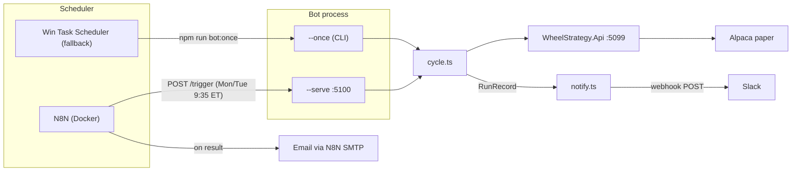

# Bot automation — N8N scheduling + notifications

**Status: planned** (not yet implemented)

Reliable weekly triggering for the NVDA sell-to-open bot, with Slack and email notifications on every cycle outcome.

**Related:** [BOT.md](./BOT.md) (bot overview) | [ROADMAP.md](./ROADMAP.md) (full backlog)

---

## Architecture



**Two trigger paths, same cycle logic:**

- **N8N cron** hits `POST http://localhost:5100/trigger` and receives the `RunRecord` JSON. N8N workflow parses the result and sends email. The bot also fires a Slack webhook directly (works with or without N8N).
- **Windows Task Scheduler** (fallback while on local PC) runs `npm run bot:once`. The `--once` CLI path sends the same Slack webhook after the cycle. No email (that is N8N's job).
- **Long-running worker** (`npm start`) continues to work unchanged for manual use; it also fires Slack on each cycle.

When the stack moves to a dedicated host: run N8N + bot + API as Docker containers, drop Task Scheduler, and the HTTP trigger path is the only one needed.

---

## 1. HTTP trigger server (`--serve` mode)

Add a third mode to [`bot/src/index.ts`](../bot/src/index.ts): `--serve` starts a minimal HTTP server on `BOT_SERVE_PORT` (default `5100`).

Two endpoints using Node's built-in `node:http` (no Express dependency):

| Method | Path | Behavior |
|--------|------|----------|
| `POST` | `/trigger` | Runs `runSellToOpenCycle()` with calendar-aware target Friday. Returns `200` + `RunRecord` JSON. Returns `409` if a cycle is already running (mutex). Returns `503` if the API health check fails. |
| `GET` | `/health` | Returns `{"ok":true, "dryRun":true, "symbol":"NVDA"}` for N8N probes. |

New file: `bot/src/server.ts` (~60 lines).

---

## 2. Slack notifications (`notify.ts`)

New file: `bot/src/notify.ts`.

- Reads `BOT_SLACK_WEBHOOK_URL` from env. If unset, notifications are silently skipped (opt-in).
- Single function `notifySlack(record: RunRecord): Promise<void>` — POST to the Slack incoming webhook URL with a formatted message block.
- Color coding: green for `filled`/`dry_run`, amber for `skipped`/`canceled`, red for `blocked`/`error`.
- Fields: symbol, side, strike, limit, status, reason, target Friday, dry-run flag.
- Called at the end of every cycle path (all three modes: worker, `--once`, `--serve`).
- Fire-and-forget with a 5s timeout — a Slack failure never blocks or crashes the bot.

Wired into `bot/src/cycle.ts`: call `notifySlack(record)` right after `appendRun(record)` in each exit path.

---

## 3. N8N workflow

Exported as `bot/n8n/wheel-bot-weekly.json` (importable into N8N UI).

| Node | Config |
|------|--------|
| **Cron Trigger** | `35 13 * * 1,2` (UTC = 9:35 ET during EDT; `35 14 * * 1,2` during EST). Two fires per week. |
| **HTTP Request** | `POST http://host.docker.internal:5100/trigger`. Timeout 120s. Expects JSON. |
| **IF** | Branch on `status`: `filled`/`placed`/`dry_run` → success; `error`/`blocked` → error; `skipped`/`canceled` → info. |
| **Send Email (success)** | Subject: `[Wheel Bot] {status}: {symbol} {side} {strike} exp {targetFriday}`. Body: formatted record. |
| **Send Email (error)** | Subject: `[Wheel Bot ERROR] {status}: {reason}`. Includes blockers. |
| **Send Email (info)** | Subject: `[Wheel Bot] skipped: {reason}`. Lighter body. |

N8N credential placeholders for SMTP (host, port, user, pass) — user configures in N8N UI after import.

---

## 4. Config additions

New env vars in `bot/.env.example` and `bot/src/config.ts`:

| Variable | Default | Used by |
|----------|---------|---------|
| `BOT_SERVE_PORT` | `5100` | `--serve` mode only |
| `BOT_SLACK_WEBHOOK_URL` | (empty) | All modes; empty = no Slack |

---

## 5. Package scripts

`bot/package.json`:
```json
"serve": "tsx src/index.ts --serve"
```

Root `package.json`:
```json
"bot:serve": "npm --prefix bot run serve"
```

---

## 6. EST / EDT cron shift

N8N's Schedule Trigger node supports IANA timezones (`America/New_York`), which handles DST automatically. If using raw cron (no TZ support), switch between `35 13` (EDT) and `35 14` (EST) at the March/November transitions.

---

## 7. Migration to dedicated Docker host

When N8N + bot + API move to an always-on server:

1. Add a `Dockerfile` to `bot/` (Node 22 slim, `npm ci`, `CMD ["node", "--import", "tsx", "src/index.ts", "--serve"]`).
2. Add bot + API services to a `docker-compose.yml` alongside N8N.
3. N8N workflow URL changes from `host.docker.internal:5100` to `bot:5100` (Docker network).
4. Drop Windows Task Scheduler.

The Dockerfile and compose file are out of scope until the host is ready. The HTTP trigger + notification design requires no changes for the migration.

---

## What does NOT need an LLM

The entire trigger + notify pipeline is deterministic. No Ollama or local LLM is needed. An LLM becomes relevant later for:

- Early-close judgment calls (the `evaluateEarlyCloseCoveredCall` scaffold)
- Multi-ticker selection from watchlist
- Anomaly / catalyst skip decisions

Those are tracked in [ROADMAP.md](./ROADMAP.md) under Future / Exploratory.
