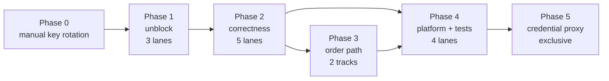

# Wheel Desk — Remediation Plan & Roadmap

Setup and run: [PRE_LAUNCH.md](./PRE_LAUNCH.md) · [LAUNCH.md](./LAUNCH.md)

Evidence base for every finding ID below: [CODE_REVIEW.md](./CODE_REVIEW.md)

Institutional outline vs current desk (feature gaps, not defects): [trading-desk-gaps.md](./trading-desk-gaps.md) · [trading-desk-outline.md](./trading-desk-outline.md)

**Mission:** this is a **trading desk**, currently focused on the wheel strategy —
research, analysis, execution, and position management in one cockpit. Keep building
so the desk can grow to other options strategies and asset classes.

---

## Status snapshots

**2026-06-04 — analysis API live.** A .NET 10 backend (`backend/WheelStrategy.Api`) serves
`GET /api/analysis/wheel`, returning safe/regular/risky strike suggestions for the
cash-secured put and covered call, each annotated with an empirical
(historical-percentile) and a Black-Scholes assignment probability, estimated premium,
and annualized yield. Surfaced via `WheelAnalysisPanel` inside `WatchlistTickerDetail`.

**2026-07-18 — order execution shipped.** The desk fetches the next-Friday option chain
from Alpaca, snaps the safe/regular/risky strikes to listed contracts, prices them from
live snapshots, and **sells-to-open** with a single-working-order lifecycle
(place → accept → cancel-with-confirm), plus a mock path. See `fetchFridayOptions.ts`,
`optionOrders.ts`, `usePendingOptionOrder.ts`, `OpenOptionsSection.tsx`.

**2026-07-25 — full code review completed.** [CODE_REVIEW.md](./CODE_REVIEW.md) graded
**107 findings** against commit `f52f980`: 5 Critical, 21 High, 46 Medium, 35 Low. The
engineering fundamentals are strong (strict TypeScript, correct Black-Scholes, genuine
order idempotency), but defects cluster in five places: secrets in the bundle, market
data that is quietly wrong, React wiring around the order state machine, failures that
render as confident numbers, and the absence of a safe environment to test execution in.
**Remediation now leads this roadmap; features resume after Phase 3.**

**2026-07-25 (later) — Phase 1 lanes 1.1–1.2 landed** (`5ca1bcd`, `9b9b9c7`). Lane 1.1
retired [C-4](./CODE_REVIEW.md#c-4--tickertabcss-is-dropped-from-the-production-bundle-breaking-every-detail-page-header),
the `key` half of [C-3](./CODE_REVIEW.md#c-3--order-state-leaks-between-ticker-tabs),
[H-17](./CODE_REVIEW.md#h-17--the-topbar-refresh-button-silently-swallows-every-error),
M-39, M-43, and regenerated API types (partial [H-19](./CODE_REVIEW.md#h-19--generated-api-types-are-stale-and-the-contract-rule-is-being-bypassed)).
Lane 1.2 fixed [H-11](./CODE_REVIEW.md#h-11--sell-to-open-is-unreachable-in-mock-mode) — mock mode can
place, poll, and cancel simulated sell-to-open orders end to end. Phase 0 (key rotation) and
Lane 1.3 (CI, ESLint, xunit) remain open; Phase 3 is unblocked pending 1.3 for tests only.

---

## How to use this document

Two halves, in priority order:

1. **[Remediation](#remediation-plan)** — Phases 0-5, partitioned into *lanes*. Each lane
   owns a disjoint set of files so lanes in the same phase can be worked concurrently by
   separate agents. Every lane names its findings, its owned files, what blocks it, and a
   suggested model.
2. **[Feature roadmap](#feature-roadmap)** — what to build once the desk is trustworthy.
   Several entries carry prerequisites from Phase 1-3; those are marked.

**Why lanes and not severity order.** [CODE_REVIEW.md §10](./CODE_REVIEW.md#10-suggested-order-of-work)
lists work by severity, which is the right way to *read* the review and the wrong way to
*parallelize* it: C-1, C-2, C-3, H-7, H-8, H-9, H-10 and H-13 all converge on three files
(`alpacaClient.ts`, `usePendingOptionOrder.ts`, `OpenOptionsSection.tsx`). Launching agents
against that list concurrently guarantees collisions on the money path. The lanes below
re-partition the identical findings by **exclusive file ownership**.

---

# Remediation plan

## Phase dependency graph



## Launch board

| Phase | Lane | Scope | Findings | Tier | Blocked by | Status |
|---|---|---|---|---|---|---|
| 0 | — | Rotate keys (manual, no agent) | C-1, H-20 partial | human | — | open |
| 1 | 1.1 | Quick wins | 5 | 3 | — | **done** `5ca1bcd` |
| 1 | 1.2 | Mock-mode unlock | 1 | 2 | — | **done** `9b9b9c7` |
| 1 | 1.3 | Scaffolds: tests, lint, CI | 4 | 3 | — | partial (H-19 in 1.1) |
| 2 | 2.1 | Market data correctness | 8 | 2 | 1.1 | open |
| 2 | 2.2 | Backend bar cache | 3 | 2 (.NET) | — | open |
| 2 | 2.3 | Backend statistics | 18 | **1** | 1.3 | open |
| 2 | 2.4 | Watchlist store | 7 | 2 | — | open |
| 2 | 2.5 | Display and utils | 9 | 2 | — | open |
| 3 | 3.1 | Order state machine | 8 | **1** | 1.1, 1.2 | open |
| 3 | 3.2 | Order semantics and pricing | 12 | **1** | 1.2, 3.1 | open |
| 3 | 3.3 | Order UI | 8 | 2 | 3.2 | open |
| 4 | 4.1 | Backend platform | 8 | 2 (.NET) | 2.2, 2.3 | open |
| 4 | 4.2 | Tests | 1 | 2 | 1.2, 1.3, 2.x, 3.x | open |
| 4 | 4.3 | Fetch and transport hardening | 13 | 2 | 2.1 | open |
| 4 | 4.4 | Perf and accessibility | 5 | 3 | 1.1 | open |
| 5 | 5.1 | Credential proxy | 1 | **1** | everything | open |

Peak useful concurrency is **5 agents** (Phase 2). Tier refers to the
[model selection guide](#model-selection-guide). Counts sum to 111 because four findings
span two files owned by different lanes and are deliberately split — each half is scoped in
its lane:

| Finding | Split |
|---|---|
| C-3 | `key` prop in Lane 1.1; the hook-side state clear in Lane 3.1 |
| H-5 | `fetchAccountDetails.ts` in Lane 2.1; the polling-hook staleness indicators in Lane 4.3 |
| H-10 | `filled_qty` check in Lane 3.1; the outcome UI in Lane 3.3 |
| L-11 | frontend pagination cap in Lane 3.2; backend cap in Lane 4.1 |

---

## Phase 0 — manual, today, no agent

Do these by hand before launching anything. They are not code changes.

- **Rotate the Alpaca key and secret.** Per
  [C-1](./CODE_REVIEW.md#c-1--alpaca-api-key-and-secret-are-compiled-into-the-shipped-javascript)
  both are verbatim string literals in every `dist/` bundle already produced, and the same
  pair authorizes `POST /v2/orders` — not just market data.
- **Rotate the Finnhub token.** Per
  [H-20](./CODE_REVIEW.md#h-20--unvalidated-inputs-unhandled-exception-types-and-a-logged-api-key-on-the-backend)
  it is interpolated into the request URL, and `IHttpClientFactory` logs `{Uri}` at
  Information level, so it is in the console history.
- **Treat `dist/` as a secret until Phase 5 lands.** Do not deploy it, do not share it.

---

## Phase 1 — unblock (3 lanes, all concurrent)

### Lane 1.1 — quick wins — **done** (`5ca1bcd`)

- **Findings:** [C-3](./CODE_REVIEW.md#c-3--order-state-leaks-between-ticker-tabs) (`key` prop half) ✓,
  [C-4](./CODE_REVIEW.md#c-4--tickertabcss-is-dropped-from-the-production-bundle-breaking-every-detail-page-header) ✓,
  [H-17](./CODE_REVIEW.md#h-17--the-topbar-refresh-button-silently-swallows-every-error) ✓,
  M-39 ✓, M-43 ✓
- **Owns:** [src/WheelDashboard.tsx](../src/WheelDashboard.tsx), [src/index.css](../src/index.css),
  [src/theme/tickerTab.css](../src/theme/tickerTab.css), and deletion of the root `WheelDashboard.tsx`
- **Blocked by:** nothing
- **Model:** Tier 3

Five near-one-line fixes with the highest value-per-token in the plan. Add
`key={activePosition.id}` / `key={activeWatchlistTicker}` (this alone eliminates the
cross-tab cancel-the-wrong-order bug), move the `@import` above all rules in `index.css`,
wrap `onRefresh={() => void refresh()}`, restore a `:focus-visible` rule after
`button { all: unset }`, and delete the dead root-level duplicate component. Also add the
missing `.ticker-tab-bar__tab--active` rule that `TabBar.tsx:39` applies but the stylesheet
never defined. Verify by confirming the built CSS grew beyond 394 bytes.

### Lane 1.2 — mock-mode unlock — **done** (`9b9b9c7`)

- **Findings:** [H-11](./CODE_REVIEW.md#h-11--sell-to-open-is-unreachable-in-mock-mode) ✓
- **Owns:** [src/api/fetchFridayOptions.ts](../src/api/fetchFridayOptions.ts),
  [src/api/preTradeCheck.ts](../src/api/preTradeCheck.ts), and the single `tradable:` expression
  in [src/components/OpenOptionsSection.tsx](../src/components/OpenOptionsSection.tsx)
- **Blocked by:** nothing
- **Model:** Tier 2

**This lane gates Phase 3 and Lane 4.2.** Until sell-to-open is reachable in mock mode, the
phase machine, `waitForOrderAcceptance`, and the cancel-confirmation path can only be
exercised against a live broker — which is the enabling condition for most execution bugs
in the review. Synthesize plausible OSI symbols via `buildOsiSymbol(...)` instead of the
`MOCK` prefix, and gate tradability on a real `row.tradable` flag rather than a string
prefix. Keep the `tradable` blocker itself; it is correct and valuable in live mode.

### Lane 1.3 — scaffolds

- **Findings:** [H-19](./CODE_REVIEW.md#h-19--generated-api-types-are-stale-and-the-contract-rule-is-being-bypassed) **partial** (`5ca1bcd` — `gen:api` + catalyst types; CI/ESLint/xunit still open),
  M-44, M-45, L-34
- **Owns:** new `backend/WheelStrategy.Api.Tests/` project, new `eslint.config.js`, new
  `.github/workflows/ci.yml`, new `.gitattributes`, [package.json](../package.json),
  [src/api/generated/analysis.ts](../src/api/generated/analysis.ts), [src/types.ts](../src/types.ts)
- **Blocked by:** nothing
- **Model:** Tier 3

Almost entirely new files, so conflict-free. ~~Run `npm run gen:api` and commit the result,
then delete the hand-written `CatalystEvent` / `TickerCatalystsResult` duplicates in
`types.ts:97-130` and point `fetchCatalysts.ts` at the generated types.~~ **Done in `5ca1bcd`.**
Add
`typescript-eslint` with the `react-hooks` plugin — `exhaustive-deps` is directly relevant
to C-2. Wire `npm run check:api`, `npm run build`, `npm test`, and `dotnet build` into CI
so the guard that already exists actually gates something. Create the xunit project as an
empty scaffold; Lane 2.3 and Lane 4.2 fill it.

**Two caveats to respect:** do not run `eslint --fix` across the tree while other lanes are
open — land the config with warnings tolerated and clean up in Phase 4. And re-run
`npm run gen:api` at the end of any later phase that touches a DTO.

---

## Phase 2 — correctness (5 lanes, all concurrent, fully disjoint)

### Lane 2.1 — market data correctness

- **Findings:** [H-1](./CODE_REVIEW.md#h-1--the-multi-symbol-bar-limit-is-a-total-not-per-symbol-so-most-symbols-get-nothing),
  [H-2](./CODE_REVIEW.md#h-2--frontend-bar-requests-omit-adjustmentall),
  [H-3](./CODE_REVIEW.md#h-3--only-one-option-leg-per-underlying-survives),
  [H-4](./CODE_REVIEW.md#h-4--snapshot-sub-objects-are-dereferenced-without-optional-chaining),
  [H-5](./CODE_REVIEW.md#h-5--errors-are-swallowed-into-zeros-and-stale-values),
  M-7, M-10, L-26
- **Owns:** [src/api/fetchWheelPositions.ts](../src/api/fetchWheelPositions.ts),
  [src/api/fetchStockQuotes.ts](../src/api/fetchStockQuotes.ts),
  [src/hooks/useTickerSnapshot.ts](../src/hooks/useTickerSnapshot.ts),
  [src/api/fetchAccountDetails.ts](../src/api/fetchAccountDetails.ts)
- **Blocked by:** 1.1 (both touch position rendering; trivial, but sequence them)
- **Model:** Tier 2

The "quietly wrong data" cluster. Scale the bar `limit` by symbol count and follow
`next_page_token` exactly as `fetch52WeekRange` already does; add `adjustment: "all"` to
both bar requests; optional-chain every snapshot sub-object; make failure visible instead
of returning `0`.

**Scope H-3 to its minimal form:** accumulate all legs, sum `unrealizedPnL` and
`premiumCollectedTotal` across them, pick a display leg deterministically, and show a
"2 legs" indicator. Keep `activeOption` singular — turning it into an array ripples into
`OpenOptionsSection` and `TickerDetail` and would collide with Phase 3. The full
multi-leg model is a follow-on.

**Note on H-5:** confine changes to `fetchAccountDetails.ts` here. The hook-side staleness
indicators in `useWheelPositions` and `useWatchlist` belong to Lane 4.3, which owns those
files.

### Lane 2.2 — backend bar cache

- **Findings:** [C-5](./CODE_REVIEW.md#c-5--the-bar-cache-never-backfills-analysis-silently-runs-on-truncated-history),
  M-24, M-25
- **Owns:** [backend/WheelStrategy.Api/Services/BarCacheService.cs](../backend/WheelStrategy.Api/Services/BarCacheService.cs)
- **Blocked by:** nothing
- **Model:** Tier 2, .NET-strong

Single file, fully isolated. Only use the incremental anchor when the cache already covers
the requested start; prefer a per-`(symbol, timeframe)` coverage-bounds metadata table over
inferring bounds from row extents, since a recently-IPO'd symbol will otherwise re-fetch
its full range on every call. Wrap the read-modify-write in a transaction or symbol lock so
concurrent same-symbol requests stop violating the unique index, and do not delete cached
rows on `refresh=true` until the replacement fetch has succeeded.

### Lane 2.3 — backend statistics

- **Findings:** [H-14](./CODE_REVIEW.md#h-14--the-hmm-forecast-applies-the-terminal-states-mean-to-every-period),
  M-26 through M-32, L-1 through L-10
- **Owns:** `Services/WheelAnalysisService.cs`, `Services/HmmTrendService.cs`,
  `Stats/GaussianHmm.cs`, `Stats/StatMath.cs`, `Contracts/WheelAnalysisDtos.cs`,
  `Contracts/HmmTrendDtos.cs`, plus new tests in the Phase 1.3 xunit project
- **Blocked by:** 1.3 (needs the test project to exist)
- **Model:** **Tier 1**

The largest single lane and the one place where the fix requires actual derivation. H-14 is
a real formula error: `ForecastStateProbs` returns the distribution after all H transitions,
so multiplying its expected return by H reports roughly H times the *unconditional* mean.
Accumulate along the path instead — the review gives the corrected loop and a worked
magnitude check (−2.92% correct vs −1.29% produced).

Stop coercing `NaN` to `0` (M-26): a failed calculation currently renders as the most
attractive possible trade, 0% assignment probability at $0.00 premium. Make those DTO
fields nullable and let the UI render an em dash.

**This lane changes DTOs.** It must finish with `dotnet build` then `npm run gen:api`, and
no other lane may hold `src/api/generated/analysis.ts` or `src/types.ts` while it runs. See
the [DTO-change protocol](#concurrency-contract).

L-10 (erf absolute error of 1.5e-7) needs no code change — record it as accepted, since the
0.15-0.45 probability range in use is unaffected.

### Lane 2.4 — watchlist store

- **Findings:** M-34 through M-37, L-20, L-21, L-22
- **Owns:** [src/store/watchlistStore.ts](../src/store/watchlistStore.ts) only
- **Blocked by:** nothing
- **Model:** Tier 2

One file, zero external conflicts — the cleanest lane to launch. Validate the `version: 2`
payload shape before trusting it (a malformed value currently white-screens the app
permanently, since the bad state persists across reload), guard `save()` against
`QuotaExceededError`, stop force-syncing the `target` watchlist over user edits, add
cross-tab `storage` sync following the pattern `orderBlotter.subscribe` already
demonstrates, and fall back gracefully when `crypto.randomUUID` is unavailable outside a
secure context.

### Lane 2.5 — display and utils

- **Findings:** [H-15](./CODE_REVIEW.md#h-15--the-hmm-panel-renders-every-probability-100-too-small),
  M-1, M-2, M-3, M-17, M-18, L-27, L-28, L-35
- **Owns:** [src/utils/formatters.ts](../src/utils/formatters.ts),
  [src/utils/trendMetrics.ts](../src/utils/trendMetrics.ts),
  [src/utils/priceAverages.ts](../src/utils/priceAverages.ts),
  [src/utils/nextFriday.ts](../src/utils/nextFriday.ts),
  [src/utils/marketHours.ts](../src/utils/marketHours.ts),
  [src/components/ResearchSection.tsx](../src/components/ResearchSection.tsx),
  [src/components/HmmTrendChart.tsx](../src/components/HmmTrendChart.tsx),
  [src/api/fetchAccountActivities.ts](../src/api/fetchAccountActivities.ts),
  [src/components/WatchlistPanel.tsx](../src/components/WatchlistPanel.tsx)
- **Blocked by:** nothing
- **Model:** Tier 2

Small, well-specified, mostly covered by existing test files. H-15 is the visible one: the
HMM panel renders every probability 100x too small, so a 71%-bull model reads as `+0.71%`
while the hover strip beside it correctly says `71%`. Add `fmt.pctFromRatio` rather than
changing `fmt.pct` — every other caller already honours the existing contract.

**Keep `formatters.ts` changes strictly additive** (new helper plus `Number.isFinite`
guards); it is imported nearly everywhere and a signature change would collide with every
open lane. Note that M-17's `nextFriday.ts` timezone fix affects `preTradeCheck.dteUntil`,
owned by Lane 3.2 — land 2.5 first.

---

## Phase 3 — order path (2 tracks; do not merge them)

### Track A

#### Lane 3.1 — order state machine

- **Findings:** [C-2](./CODE_REVIEW.md#c-2--place-aborts-its-own-acceptance-wait-leaving-a-live-unmonitored-order),
  [C-3](./CODE_REVIEW.md#c-3--order-state-leaks-between-ticker-tabs) (hook-side clear),
  [H-9](./CODE_REVIEW.md#h-9--reset-discards-a-live-order-and-re-enables-sell),
  [H-10](./CODE_REVIEW.md#h-10--a-partially-filled-order-that-is-then-cancelled-is-silently-erased) (hook side),
  M-8, M-12, M-19, M-23
- **Owns:** [src/hooks/usePendingOptionOrder.ts](../src/hooks/usePendingOptionOrder.ts),
  [src/store/orderBlotter.ts](../src/store/orderBlotter.ts)
- **Blocked by:** 1.1, 1.2
- **Model:** **Tier 1**

The hardest reasoning in the repository, and one agent working serially — C-2 restructures
the hook wholesale. Move the client order ID into a ref so `transition`'s identity stops
changing mid-submit, split the mount/resume effect so it keys only on `[underlying, enabled]`,
and let `place`/`cancel` own their abort controllers and reset `flightRef` only in their own
`finally`. Today the first order of every session aborts its own acceptance wait and leaves
a live, unpolled, unacknowledged order at the venue.

Then: make `reset()` refuse to discard an order whose last-known status is still open,
inspect `filled_qty` on a confirmed cancel so a partial fill is not silently erased, stop
writing a blotter transition when `to === from`, and consult
`orderBlotter.getOpenForUnderlying()` in `place()` so the one-order-per-underlying invariant
holds across tabs rather than per hook instance.

### Track B — strictly sequential

#### Lane 3.2 — order semantics and pricing

- **Findings:** [H-7](./CODE_REVIEW.md#h-7--done_for_day-is-treated-as-a-fill),
  [H-12](./CODE_REVIEW.md#h-12--contract-multiplier--size--tradable-are-ignored),
  [H-13](./CODE_REVIEW.md#h-13--option-limit-prices-are-not-rounded-to-a-valid-tick),
  M-11, M-13, M-15, M-16, L-11 (frontend half), L-14, L-17, L-18, L-19
- **Owns:** [src/api/optionOrders.ts](../src/api/optionOrders.ts),
  [src/api/fetchFridayOptions.ts](../src/api/fetchFridayOptions.ts),
  [src/api/preTradeCheck.ts](../src/api/preTradeCheck.ts),
  [src/hooks/useFridayOptionSuggestions.ts](../src/hooks/useFridayOptionSuggestions.ts)
- **Blocked by:** 1.2, 3.1
- **Model:** **Tier 1**

Money math. `done_for_day` is not a fill — decide on quantity, not the status string, and
map an unfilled `done_for_day` to a terminal state that *unlocks* the underlying. Round
limits to the correct tick ($0.01 below $3.00, $0.05 at or above) and always away from your
own side, or most contracts above $3 will be rejected for a tick violation. Carry
`multiplier`, `size`, `tradable`, and `root_symbol` onto `FridayOptionRow` and filter to
`root_symbol === symbol && multiplier === "100"`, so an adjusted contract can never be sold
as if it delivered 100 shares. Check collateral against `options_buying_power`, not
`buyingPower`, which on a Reg-T margin account is roughly twice equity and quietly turns
cash-secured puts into naked ones.

**Also expose a `fetchContractSnapshot(contractSymbol)` helper** for Lane 3.3 to consume —
H-8's real fix needs a live quote for an arbitrary contract, and this lane already owns the
`/v1beta1/options/snapshots` call.

**Cross-track hazard.** H-7 changes `isOrderFilled` from taking a status string to taking an
order object, and `usePendingOptionOrder.ts:30` calls it. Land 3.1 first, or ship a
back-compat overload here.

#### Lane 3.3 — order UI

- **Findings:** [H-8](./CODE_REVIEW.md#h-8--buy-to-close-and-roll-fabricate-a-bidask-defeating-the-fat-finger-guard),
  [H-16](./CODE_REVIEW.md#h-16--changing-the-expiration-shows-the-previous-expirations-strikes-under-the-new-header),
  [H-10](./CODE_REVIEW.md#h-10--a-partially-filled-order-that-is-then-cancelled-is-silently-erased) (UI side),
  M-14, M-20, M-21, M-22, M-40
- **Owns:** [src/components/OpenOptionsSection.tsx](../src/components/OpenOptionsSection.tsx),
  [src/components/OrderTicket.tsx](../src/components/OrderTicket.tsx)
- **Blocked by:** 3.2 (consumes its snapshot helper)
- **Model:** Tier 2

H-8 is the live-mode hazard: close and roll fabricate `bid = mid * 0.95` / `ask = mid * 1.05`
around a position mark up to five minutes old, which makes the fat-finger band exactly zero
and suppresses the "no live bid/ask" warning. Fetch a real snapshot; until then pass
`null`s so the warning fires honestly.

Then: clear the ladder rows while a new expiration is loading and disable SELL during the
fetch, so the header can never advertise 55 DTE above 6-DTE contracts; fix the inverted
`% OTM` colour for puts; derive the roll ticket's `optionType` from the same source as
`openRow`; send `position_intent` on `buy_to_close`; clamp quantity to `maxQty` and reset
`acked` when it changes; and let the focus highlight actually expire.

---

## Phase 4 — platform, hardening, tests (4 lanes, concurrent)

### Lane 4.1 — backend platform

- **Findings:** [H-18](./CODE_REVIEW.md#h-18--microsoftopenapi-200-carries-a-known-high-severity-advisory),
  [H-20](./CODE_REVIEW.md#h-20--unvalidated-inputs-unhandled-exception-types-and-a-logged-api-key-on-the-backend),
  M-33, L-11 (backend half), L-12, L-13, L-32, L-33
- **Owns:** `WheelStrategy.Api.csproj`, `Program.cs`, `Endpoints/*.cs`,
  `Services/CatalystsService.cs`, `Alpaca/AlpacaMarketDataClient.cs`, `appsettings*.json`
- **Blocked by:** 2.2, 2.3 — H-20 injects `ILogger` into those same services
- **Model:** Tier 2, .NET-strong

Clamp `lookbackDays` and `dte` and validate `symbol` at the endpoints (today
`?lookbackDays=2000000000` returns a 500 with a stack trace, and `lookbackDays=100000` is an
unauthenticated cost attack on a metered third-party API). Add `AddProblemDetails()` and
`UseExceptionHandler()`, catch `TaskCanceledException` and `JsonException` alongside
`HttpRequestException`, set explicit `HttpClient` timeouts, and cap the pagination loops.
Move the Finnhub token from the URL into the `X-Finnhub-Token` header and set
`"System.Net.Http.HttpClient": "Warning"`. Inject `ILogger` — no service or endpoint
currently has one. Pin `Microsoft.OpenApi` to a patched version and replace the floating
`10.*` / `9.*` versions, following the comment pattern already used for
`SQLitePCLRaw.bundle_e_sqlite3`. Convert `EnsureCreated()` to migrations (L-33) while you
are in `Program.cs`.

### Lane 4.2 — tests

- **Findings:** [H-21](./CODE_REVIEW.md#h-21--the-analysis-engine-and-the-order-state-machine-have-no-tests)
- **Owns:** new test files only — no production file
- **Blocked by:** 1.2 (order tests need mock mode), 1.3 (test project), and any lane whose
  behavior it locks in
- **Model:** Tier 2

All new files, so it never conflicts — but it must follow the lanes it verifies. Target the
four untested areas where a bug costs money: `usePendingOptionOrder` (454 lines, zero
tests), `fetchFridayOptions`, `optionOrders`, `tradeUpdatesStream`, plus component tests for
`OpenOptionsSection` and `OrderTicket` with `@testing-library/react`, already a dependency.
On the backend, golden-value tests for `StatMath` (Black-Scholes has published reference
values) and `GaussianHmm`. C-2, C-3, H-7, H-14 and H-16 are all straightforwardly testable
and any one of these tests would have caught them.

### Lane 4.3 — fetch and transport hardening

- **Findings:** [H-6](./CODE_REVIEW.md#h-6--no-request-timeouts-no-in-flight-guard-and-an-n3-fan-out-that-will-trip-alpacas-rate-limit),
  [H-5](./CODE_REVIEW.md#h-5--errors-are-swallowed-into-zeros-and-stale-values) (hook half),
  M-4, M-5, M-6, M-9, M-38, L-15, L-16, L-23, L-24, L-25, L-29
- **Owns:** [src/api/alpacaClient.ts](../src/api/alpacaClient.ts),
  [src/api/tradeUpdatesStream.ts](../src/api/tradeUpdatesStream.ts),
  [src/api/searchAssets.ts](../src/api/searchAssets.ts),
  [src/api/fetchTickerNews.ts](../src/api/fetchTickerNews.ts),
  `src/hooks/useWheelPositions.ts`, `useWatchlist.ts`, `useAccountDetails.ts`,
  `useAccountActivities.ts`, `useWheelAnalysis.ts`, `useHmmTrend.ts`,
  `useVolatilityMetrics.ts`, `useTickerCatalysts.ts`
- **Blocked by:** 2.1 — H-5's other half lives in `useWheelPositions.ts` and `useWatchlist.ts`
- **Model:** Tier 2

Add `signal: AbortSignal.timeout(15_000)` to every request (there is currently no timeout
anywhere, so a hung connection leaves `loading` true forever), honour `Retry-After` in
`withRetry`, add sequence refs so a slow earlier response cannot overwrite a newer one, and
memoize `fetchAssetNames` — company names never change yet are re-fetched every cycle, and
the current fan-out reaches roughly 156 requests/minute against Alpaca's 200/min budget.
Dedupe the 3-4x duplicate fetches per ticker tab. Expose `staleSince` / `lastError` and
render a visible degraded-data indicator: in a trading UI, "I don't know" must not look like
`$0.00`.

### Lane 4.4 — perf and accessibility

- **Findings:** M-41, M-42, M-46, L-30, L-31
- **Owns:** [src/components/SummaryDashboard.tsx](../src/components/SummaryDashboard.tsx),
  [src/components/PriceTrendChart.tsx](../src/components/PriceTrendChart.tsx),
  [src/components/TabBar.tsx](../src/components/TabBar.tsx),
  [src/components/WatchlistItem.tsx](../src/components/WatchlistItem.tsx),
  [vite.config.ts](../vite.config.ts)
- **Blocked by:** 1.1 (M-39's focus-ring work lands there first)
- **Model:** Tier 3

Memoize the `SummaryDashboard` ledger and the recharts sparklines; move
`PriceTrendChart`'s `data.find(...)!.date` below its own empty-data guard and add an error
boundary so one `NaN` cannot unmount the detail page; split the 745 kB bundle so recharts
loads only with the charts. Give the `TabBar` close control real button semantics, make
watchlist rows keyboard-reachable, name the icon-only controls, and add a non-colour
encoding to the HMM regime ribbon.

---

## Phase 5 — credential proxy (exclusive; nothing else runs)

### Lane 5.1 — move Alpaca credentials server-side

- **Findings:** [C-1](./CODE_REVIEW.md#c-1--alpaca-api-key-and-secret-are-compiled-into-the-shipped-javascript)
- **Owns:** new `Endpoints/AlpacaProxyEndpoints.cs`, `Program.cs`,
  [src/api/alpacaClient.ts](../src/api/alpacaClient.ts),
  [src/api/tradeUpdatesStream.ts](../src/api/tradeUpdatesStream.ts),
  [src/config.ts](../src/config.ts), [src/vite-env.d.ts](../src/vite-env.d.ts),
  [.env.example](../.env.example), [docs/PRE_LAUNCH.md](./PRE_LAUNCH.md)
- **Blocked by:** everything — it collides with Lane 4.1 (`Program.cs`) and Lane 4.3
  (`alpacaClient.ts`), which is exactly why it is last and exclusive
- **Model:** **Tier 1**

Deferred by decision: the risk is currently capped by localhost-only serving and a paper
endpoint, and correctness fixes come first. Both caps evaporate the moment this is deployed
or a live key is pasted in, and `constants.ts:27` already reserves an `alpaca-live` slot.

Add a passthrough controller forwarding `/v2/positions`, `/v2/account`,
`/v2/account/activities`, `/v2/assets`, `/v2/options/contracts`, `/v2/orders`, and the
market-data endpoints, injecting the `APCA-*` headers server-side. `Program.cs:57` restricts
CORS to `WithMethods("GET")`, so order placement needs `POST`/`DELETE` added — and the proxy
must validate the order body rather than forwarding it blind. Point `alpacaClient.ts` at
`API_BASE` and delete `authHeaders()`; the CORS `Content-Type` workaround becomes
unnecessary. Switch `config.ts` from deriving `IS_MOCK` off key presence to an explicit
`VITE_USE_MOCK` flag, and strip the secrets from `.env.example`, `vite-env.d.ts`, and
`PRE_LAUNCH.md`.

---

## Concurrency contract

Rules for launching agents against this plan without them stepping on each other.

- **One owner per file per phase.** The lane lists are the authority. If two lanes want the
  same file, the phase boundary is wrong — move one lane later rather than letting both edit.
- **Hot files, never co-edit.** These attract the most findings and cause the most conflicts:
  `alpacaClient.ts`, `usePendingOptionOrder.ts`, `OpenOptionsSection.tsx`,
  `fetchWheelPositions.ts`, `formatters.ts`, `Program.cs`.
- **DTO-change protocol.** Any change under `backend/WheelStrategy.Api/Contracts/` requires
  `dotnet build` followed by `npm run gen:api` **in the same lane**, and no other lane may
  hold `src/api/generated/analysis.ts` or `src/types.ts` open while it runs. Only Lane 1.3
  and Lane 2.3 are permitted to touch generated types. This is precisely the drift mechanism
  behind H-19 — do not recreate it.
- **Additive-only for shared modules.** `formatters.ts`, `types.ts`, and `alpacaTypes.ts` are
  imported nearly everywhere. Add new exports; do not change existing signatures outside the
  owning lane.
- **Per-lane verification gate**, before handing back:

```bash
npm run build && npm test && npx tsc -b && npm run check:api
cd backend/WheelStrategy.Api && dotnet build
```

- **Run tests from an uppercase drive letter.** `cd "C:/repos/wheel-strategy"` first. From
  `c:\...` (lowercase), vitest resolves its own module twice and 10 of 14 files fail before
  any test runs — see [CODE_REVIEW.md §8](./CODE_REVIEW.md#8-developer-environment-caveat-vitest-and-the-lowercase-drive-letter).
  This is an environment artifact, not a defect.
- **Sequencing signal.** Before launching a lane, check that every lane in its "Blocked by"
  list has landed. Lanes with no blocker in the same phase are safe to launch simultaneously.

---

## Model selection guide

Assignments reflect where a plausible-looking wrong answer is expensive versus where the
review already wrote the fix out in full.

**Tier 1 — reserve for exactly four lanes.** `claude-opus-5-thinking-high`
(alternate: `claude-4.6-opus-high-thinking`)

- **Lane 3.1** — React effect identity, abort-controller ownership, async races in a state
  machine that places real orders.
- **Lane 3.2** — collateral, tick rounding, and contract-multiplier math where being
  confidently wrong costs money directly.
- **Lane 2.3** — the HMM path-accumulation derivation and the decision about which failure
  modes become nullable rather than zero.
- **Lane 5.1** — security architecture and a CORS/proxy surface that must validate rather
  than forward.

**Tier 2 — the bulk.** `claude-sonnet-5-thinking-high`
(alternates: `claude-4.6-sonnet-medium-thinking`; `cursor-grok-4.5-high-fast` for the test
volume in Lane 4.2)

- Lanes 1.2, 2.1, 2.4, 2.5, 3.3, 4.2, 4.3. Every finding here is precisely located with the
  fix spelled out in the review, so the work is careful execution rather than discovery.

**Tier 2, .NET-strong.** `gpt-5.6-terra-medium`, or Sonnet paired with the Microsoft Learn
MCP for EF Core and ASP.NET API verification

- Lanes 2.2 and 4.1.

**Tier 3 — mechanical.** `composer-2.5-fast` or `claude-4.5-haiku-thinking`

- Lanes 1.1, 1.3, 4.4. Single-line edits, config files, dependency pins, new scaffolding.

**Budget shape.** Saturate throughput with Tier 2 and Tier 3 lanes running concurrently and
spend the Opus allowance only on the four Tier 1 lanes. Phase 2 supports five agents at
once; Phases 1 and 4 support three to four. Phase 3 is deliberately narrow — two tracks, and
Track B is internally sequential. If the daily budget is tight, Lane 1.1 alone retires two
Criticals and a High for near-zero cost and is always worth launching first.

---

# Feature roadmap

Resume after Phase 3. Items are roughly ordered by value-to-effort; prerequisites from the
remediation plan are called out where they exist.

## Near-term (high value, low effort)

- **Daily-granularity toggle in the UI.** The backend already accepts `granularity=daily`
  (~480 overlapping samples vs ~99 weekly), which tightens the percentile tails. Add a
  weekly/daily switch next to the DTE selector and pass it through `useWheelAnalysis`.
  Surface `sampleCount` prominently so the user sees the tradeoff.
  **Prerequisite: Lane 2.2 (C-5).** Until the bar cache backfills, widening the lookback
  serves truncated history under a wider label. Also surface M-29's effective sample size,
  which for the weekly default is roughly a quarter of the reported count.
- **Distribution visualization.** Render a small histogram / density of the forward-return
  distribution with the three put and three call strikes marked. Makes "safe/regular/risky"
  intuitive at a glance.
- **Persist DTE / lookback / granularity preferences** so the panel remembers settings per
  session. **Prerequisite: Lane 2.4** — reuse the hardened store rather than adding another
  unguarded `localStorage` writer.
- ~~**Tighten strike rounding to real option grids.**~~ **Done, with two caveats.**
  `fetchFridayOptions` snaps each suggested strike to the nearest listed Alpaca contract.
  But M-13 shows the snapped row still copies the *un-snapped* assignment probabilities and
  premium, and H-13 shows the limit price is not rounded to a valid tick. Both are in
  Lane 3.2.

## Medium-term (deeper analysis)

- ~~**Live option-chain integration.**~~ **Done for the sell-to-open ladder, with a caveat.**
  That path prices from real `/v1beta1/options/snapshots` quotes. But H-8 shows close and
  roll still fabricate a bid/ask around a stale position mark, which disables the
  fat-finger guard entirely — Lane 3.3.
  *Still open:* surface the true **delta**, so "regular ≈ 0.30 delta" uses the option's own
  delta rather than the model's assignment probability.
- **Implied vs realized volatility.** Show option-implied vol alongside the realized vol the
  model uses; a large gap is itself a signal. **Upgraded from feature to disclosure by M-28**,
  which quantifies the effect: a 3-point vol gap understates a ~$5 put's premium by about
  11%, and that premium drives the yield used to rank strikes.
- **Backtest the suggestions.** For each historical date, compute what the "regular" strike
  would have been and whether it expired OTM, to validate that the empirical percentiles
  actually deliver the targeted assignment rates. Most valuable after Lane 2.2, since a
  backtest run against a non-backfilling cache measures the cache, not the model.
- **Dividend & earnings awareness.** Skip/flag expirations spanning an earnings date (vol
  crush / gap risk) and incorporate dividend yield into Black-Scholes. Note L-13: the
  catalysts service currently cannot distinguish "no earnings scheduled" from "provider
  down", which matters most for exactly this feature.
- **Multi-symbol / portfolio view.** Run the analysis across the whole watchlist and rank by
  annualized yield at a chosen assignment-probability level. **Prerequisite: Lane 4.3** —
  this multiplies the request fan-out that H-6 shows is already near Alpaca's rate limit.

## Backend features

- **Background bar refresh.** A hosted `BackgroundService` could pre-warm and refresh the
  `HistoricalBar` cache for watchlisted symbols off the request path. Build on Lane 2.2's
  coverage-bounds metadata rather than the current row-extent inference.
- **Alpaca resilience beyond retries.** Retry with backoff already exists and is thoughtfully
  asymmetric. What remains is H-6 (timeouts, `Retry-After`) in Lane 4.3, SIP-vs-IEX feed
  differences (M-10), and detecting missing-week gaps in the bar sequence rather than only
  warning about them.

*Two former entries in this section have graduated into the remediation plan: unit tests for
`StatMath` are now [H-21](./CODE_REVIEW.md#h-21--the-analysis-engine-and-the-order-state-machine-have-no-tests)
(Lanes 2.3 and 4.2), and converting `EnsureCreated()` to EF migrations is now L-33 (Lane 4.1).*

---

## Known modeling caveats

Document these for users; they are properties of the approach, not defects. Each is graded
in the review, linked below.

- **Empirical vs Black-Scholes gap is expected.** A trending stock (NVDA's uptrend, say)
  makes historical downside rarer than a zero-drift lognormal model predicts, so the
  empirical put-assignment probability can sit well below the BS probability. Both are shown
  on purpose; treat BS as the harder estimate. Graded as **L-9**: the risk-neutral `N(-d2)`
  sits beside a real-world empirical frequency, and for a 15% drift against a 4.5% rate the
  gap is about 2.2 points, always in the same direction. Worth one line in `warnings`.
- **Risky strikes can land near or through the money** when the forward-return distribution
  is strongly skewed by trend — the 45th-percentile move can be positive. `pctFromSpot` keeps
  this transparent; consider clamping to OTM if a strictly-OTM convention is preferred.
- **Overlapping windows** mean the empirical percentile confidence intervals are wider than
  the raw sample count implies. Graded as **M-29**: `MinSamples = 20` is checked against the
  overlapping count, so at the weekly default, passing the guard can mean roughly four
  independent observations. Another reason to prefer daily granularity and to lean on the BS
  probability.
- **Annualized figures are simple, not compounded**, and the covered-call yield uses spot
  while the CSP yield uses strike — defensible but asymmetric (**L-8**). `StateMeans` also
  reports an annualized *log* return labelled as a percentage (**L-5**); a 50% annualized log
  return is a 65% simple return.
