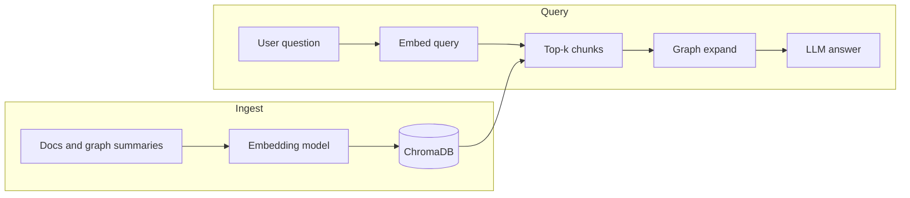
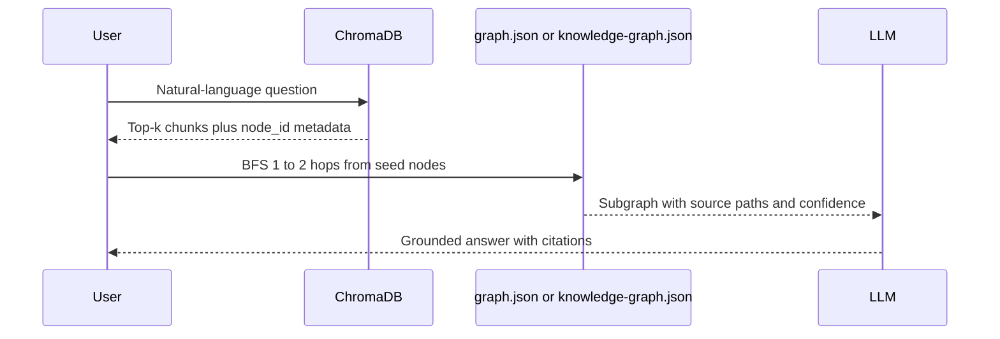
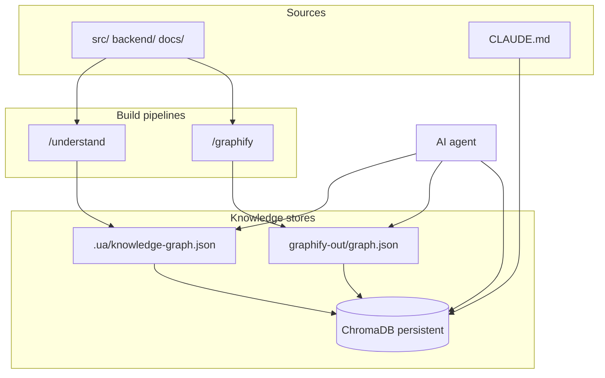

# ChromaDB and Functional Knowledge Recall

How ChromaDB complements **graphify** and **understand-anything** for AI-assisted recall of system functional knowledge. This document captures the design understanding and step-by-step implementation procedures for a future integration. **Nothing in this doc is built yet** — it is a reference for when we choose to add a semantic recall layer.

**Related:** [CLAUDE.md](../CLAUDE.md) · [trading-desk-gaps.md](./trading-desk-gaps.md) · [NEXT_STEPS.md](./NEXT_STEPS.md)

---

## 1. Purpose and scope

### What problem this solves

AI agents working on this repo need to recall **functional knowledge** — how the system behaves, not just where files live:

- Order phase machines (`idle → submitting → open → …`)
- Business invariants (one live option order per underlying)
- API contracts (analysis DTOs single-sourced from the backend)
- Gap analysis and planned behavior (docs vs shipped code)

**graphify** and **understand-anything** already build knowledge graphs from the codebase. Both excel at **structural** recall (imports, calls, dependency paths, architectural layers). Both struggle when:

1. The user's wording does not match graph node labels
2. Knowledge lives in long prose (`CLAUDE.md`, gap docs) not fully represented as nodes
3. The answer spans multiple communities and needs a semantic starting point

**ChromaDB** fills the **semantic entry-point** gap. The graphs fill **relationship and provenance** gaps. Together they form a hybrid retrieval stack for grounded agent answers.

### What this is not

- Not part of the trading desk runtime (no frontend/backend dependency)
- Not a replacement for graphify or understand-anything graphs
- Not required to develop or run the wheel strategy app today

---

## 2. ChromaDB — conceptual overview

ChromaDB is an open-source **embedding-native vector database**. For each record it stores:

| Field | Role |
|-------|------|
| **Document** | Original text chunk |
| **Embedding** | High-dimensional vector capturing semantic meaning |
| **Metadata** | Filterable key/value pairs (`node_id`, `source_file`, `layer`, …) |
| **ID** | Stable key for upsert, delete, and deduplication |

At query time the user's question is embedded with the **same model** used at ingest. Chroma returns the **nearest neighbors** by vector distance — "what text is semantically closest to this question?" This differs from:

- **Keyword grep** — exact token match, no paraphrase tolerance
- **Graph traversal** — follows explicit edges (`calls`, `imports`), not semantic similarity

ChromaDB is commonly used as the retrieval layer in **RAG** (Retrieval-Augmented Generation) pipelines: retrieve relevant chunks → pass as context to an LLM → generate a grounded answer.

**Typical strengths:** local-first (`PersistentClient`), simple Python/JS API, metadata filtering, optional built-in embedder for prototyping.

**Typical limits:** no native understanding of code dependency graphs; retrieval quality depends on chunking and embedding model choice; vectors must be refreshed when source text changes.



---

## 3. Current state — graphify and understand-anything

Neither tool uses ChromaDB in this repo today. Recall is graph-native and keyword-based.

### graphify

| Item | Location | Notes |
|------|----------|-------|
| Graph artifact | `graphify-out/graph.json` | GraphRAG-ready JSON |
| Report | `graphify-out/GRAPH_REPORT.md` | God nodes, surprising connections, suggested questions |
| Query | `graphify query "<question>"` | Vocab-constrained substring match → BFS/DFS |

**Query limitation (documented in graphify skill):** the matcher has *no stemming, no synonyms, no cross-language match*. Questions must be expanded against tokens extracted from node labels (`.vocab.txt`) before traversal.

**Strengths:** structural paths, community detection, EXTRACTED / INFERRED / AMBIGUOUS audit trail, incremental `--update`.

### understand-anything

| Item | Location | Notes |
|------|----------|-------|
| Graph artifact | `.ua/knowledge-graph.json` (or legacy `.understand-anything/`) | Typed nodes, 26 edge types, layers, tour |
| Chat skill | `/understand-chat` | Grep `name` / `summary` / `tags` → 1-hop edge expansion |

**Strengths:** architectural layers, rich edge taxonomy (`tested_by`, `configures`, `deploys`, …), guided tour, git commit freshness check.

### Comparison

| Capability | graphify | understand-anything | ChromaDB (proposed) |
|------------|----------|---------------------|---------------------|
| Dependency paths | Strong | Strong | None |
| Layer / community context | Communities | Explicit layers | Via metadata only |
| Natural-language entry | Weak (vocab match) | Weak (grep) | Strong |
| Prose / docs recall | Partial (semantic extraction) | Partial (document nodes) | Strong |
| Provenance / confidence | EXTRACTED / INFERRED tags | Edge weights, types | Metadata only |
| Incremental update | `--update` + cache | Git-diff incremental | Upsert by stable ID |

---

## 4. Hybrid architecture (target design)

ChromaDB does **not** replace the graphs. It seeds retrieval; the graph expands context and supplies citations.



### Retrieval policy (four steps)

1. **Semantic recall** — Chroma `query()` returns top-k chunks and `node_id` metadata
2. **Structural expansion** — BFS 1–2 hops from seed nodes in the active graph
3. **Provenance** — cite `source_file`, `source_location`, confidence tags from graph nodes
4. **Freshness** — compare `git_commit` in Chroma metadata vs `git rev-parse HEAD`; warn if stale (same pattern as `/understand-chat`)

### Unified data flow



### Collection design (proposed)

Single collection `functional_chunks` (name TBD at implementation):

| Metadata field | Example | Use |
|----------------|---------|-----|
| `source` | `graphify` \| `understand` \| `doc` | Filter by origin |
| `project` | `wheel-strategy` | Multi-repo support |
| `git_commit` | `abc123…` | Freshness checks |
| `node_id` | `file:src/hooks/usePendingOptionOrder.ts` | Graph seed |
| `file_path` | `docs/trading-desk-gaps.md` | Citations |
| `layer` | `execution` | Architectural filter |
| `confidence` | `EXTRACTED` \| `INFERRED` | graphify audit |
| `chunk_type` | `node_summary` \| `doc_section` \| `wiki` | Chunking strategy |

**Stable ID convention:**

- Graph node: `node:{node_id}`
- Doc chunk: `doc:{relative_path}:chunk:{n}`
- Report section: `report:{section}:{community_id}`

---

## 5. What to index (wheel-strategy corpus)

### High-priority sources

| Source | Why |
|--------|-----|
| [CLAUDE.md](../CLAUDE.md) | Mission, order execution layer, analysis contract |
| [docs/trading-desk-gaps.md](./trading-desk-gaps.md) | Shipped vs institutional requirements |
| [docs/NEXT_STEPS.md](./NEXT_STEPS.md) | Planned behavior and backlog |
| graphify `graph.json` node labels + context | Structural + semantic bridge |
| understand `knowledge-graph.json` summaries | Typed architecture recall |
| `graphify-out/GRAPH_REPORT.md` | Community-level summaries |
| Optional: graphify `--wiki` output | Narrative per-community articles |

### Example questions the hybrid stack handles better

| Question | Chroma finds | Graph expands |
|----------|--------------|---------------|
| "Can I place two sells on the same ticker in different tabs?" | `locked`, blotter, one order per underlying | `usePendingOptionOrder` → `orderBlotter` |
| "Where is assignment probability computed?" | empirical, Black-Scholes | `WheelAnalysisService`, `StatMath` |
| "What's missing for institutional OMS?" | gap matrix prose | OMS-related nodes and edges |

---

## 6. ChromaDB vs alternatives

| Approach | Best for |
|----------|----------|
| Graph only (current) | Exact dependencies, paths, layers |
| **ChromaDB** | Natural-language entry, doc-heavy corpora, paraphrase |
| Neo4j / FalkorDB (graphify `--neo4j`) | Production Cypher queries at scale |
| SQLite FTS | Exact keyword match, zero embedding cost |

**Recommendation for this repo:** ChromaDB as a **local dev assistant** index alongside existing graphify output. Python-native, aligns with graphify's toolchain, no server required for prototyping.

---

## 7. Implementation procedures (future)

Follow these phases when ready to build. Each phase has prerequisites, steps, and acceptance criteria.

### Phase 0 — Prerequisites

- [ ] Python 3.10+ available (same environment as graphify is fine)
- [ ] `pip install chromadb` (pin version in a future `scripts/requirements-kb.txt` or similar)
- [ ] At least one knowledge graph built: `graphify-out/graph.json` **or** `.ua/knowledge-graph.json`
- [ ] Decide embedding model:
  - **Prototype:** Chroma default (`all-MiniLM-L6-v2`) — zero config
  - **Production:** explicit model (OpenAI, local sentence-transformers) — record in config for reproducibility

**Acceptance:** `python -c "import chromadb; print(chromadb.__version__)"` succeeds.

---

### Phase 1 — Ingest script (read-only indexer)

Create `scripts/kb/ingest_chroma.py` (path TBD; keep outside `src/` — this is dev tooling, not app code).

**Steps:**

1. Resolve project root and git commit: `git rev-parse HEAD`
2. Open persistent Chroma client: `chromadb.PersistentClient(path="graphify-out/chroma")` (or `.ua/chroma` — pick one canonical location; document in script header)
3. `get_or_create_collection("functional_chunks")`
4. **Ingest graphify nodes** (if `graphify-out/graph.json` exists):
   - For each node: document = `label` + optional description fields; metadata = `node_id`, `source_file`, `confidence`, `source=graphify`
   - ID = `node:{id}`
5. **Ingest understand nodes** (if `.ua/knowledge-graph.json` exists):
   - For each node: document = `name` + `summary`; metadata = `node_id`, `type`, `filePath`, `tags`, `source=understand`
   - ID = `ua:{id}` (prefix avoids collision with graphify IDs)
6. **Ingest docs** — chunk markdown by heading (`##` boundaries), ~500–800 tokens per chunk:
   - Files: `CLAUDE.md`, `docs/trading-desk-gaps.md`, `docs/NEXT_STEPS.md`, `docs/LAUNCH.md`, `docs/PRE_LAUNCH.md`
   - Metadata: `file_path`, `heading`, `source=doc`, `chunk_type=doc_section`
   - ID = `doc:{path}:chunk:{n}`
7. **Ingest GRAPH_REPORT.md** sections if present
8. Upsert all records (use `collection.upsert`, not `add`, for idempotency)
9. Print summary: counts by `source`, total chunks, git commit

**Acceptance:**

- Re-running ingest is idempotent (same IDs, updated text)
- `collection.count()` > 0
- Sample query `"option order locking"` returns chunks mentioning `usePendingOptionOrder` or blotter

---

### Phase 2 — Query script (hybrid retrieval)

Create `scripts/kb/query_functional_kb.py`.

**CLI interface (proposed):**

```bash
python scripts/kb/query_functional_kb.py "How does sell-to-open locking work?" --k 8 --expand-hops 2
```

**Steps:**

1. Chroma `query(query_texts=[question], n_results=k, include=["documents", "metadatas", "distances"])`
2. Collect unique `node_id` values from metadata where present
3. Load active graph (`graphify-out/graph.json` preferred if both exist)
4. For each seed `node_id`, run BFS expansion to `--expand-hops` (reuse NetworkX pattern from graphify `query.md` fallback)
5. Output JSON:
   ```json
   {
     "question": "...",
     "chroma_hits": [...],
     "seed_node_ids": [...],
     "subgraph": { "nodes": [...], "edges": [...] },
     "git_commit_indexed": "...",
     "git_commit_current": "..."
   }
   ```
6. If indexed commit ≠ current commit, print stderr warning

**Acceptance:**

- Script runs without LLM (retrieval only)
- Subgraph includes edges between expanded nodes
- Stale-index warning appears after local commits without re-ingest

---

### Phase 3 — Agent integration

Choose one or more surfaces:

| Option | Effort | Notes |
|--------|--------|-------|
| **Cursor rule** | Low | Add guidance in `.cursor/rules/` or `CLAUDE.md`: "for functional behavior questions, run `query_functional_kb.py` first" |
| **graphify hook** | Medium | Post-commit hook (see graphify `references/hooks.md`) calls ingest after `--update` |
| **understand autoUpdate** | Medium | After `/understand` Phase 7, chain ingest script |
| **MCP server** | Higher | Expose `query_functional_kb` as MCP tool for Cursor |

**Recommended order:** query script → Cursor rule → hooks → MCP (only if needed).

**Acceptance:** Agent answering a functional question uses Chroma hits + graph expansion before guessing.

---

### Phase 4 — Incremental maintenance

**On graphify `--update`:**

1. Read graphify manifest / changed files list
2. Delete Chroma IDs for removed nodes: `collection.delete(ids=[...])`
3. Upsert changed node and doc chunks only

**On understand incremental update:**

1. Read `meta.json` `gitCommitHash` delta
2. Re-ingest nodes whose `filePath` appears in changed-files list
3. Refresh doc chunks if `docs/` or `CLAUDE.md` changed

**On full rebuild (`/graphify` or `/understand --full`):**

- Option A: `collection.delete(where={})` then full ingest
- Option B: drop and recreate collection

**Acceptance:** Incremental ingest completes in <30s for typical single-file edits.

---

### Phase 5 — Validation checklist

Before considering the integration "done":

- [ ] Paraphrase test: question uses no exact node labels; retrieval still finds correct seeds
- [ ] Path test: expanded subgraph shows `calls` / `imports` chain from seed to related modules
- [ ] Stale test: commit after ingest triggers warning
- [ ] Doc test: gap-analysis question cites `trading-desk-gaps.md` chunk
- [ ] No secrets: ingest excludes `.env`, credentials, API keys (add to skip list)
- [ ] `.gitignore`: add `graphify-out/chroma/` (or chosen persist path) if blobs should not be committed

---

## 8. Directory layout (proposed)

```
scripts/kb/
  ingest_chroma.py       # Phase 1
  query_functional_kb.py # Phase 2
  requirements.txt       # chromadb pin
  README.md              # pointer to this doc

graphify-out/
  graph.json             # existing
  chroma/                # Chroma persistent store (gitignored)

.ua/                     # if using understand-anything
  knowledge-graph.json
```

---

## 9. Open decisions (resolve at implementation time)

| Decision | Options | Notes |
|----------|---------|-------|
| Chroma persist path | `graphify-out/chroma` vs `.ua/chroma` vs `scripts/kb/.chroma` | Prefer co-location with primary graph artifact |
| Single vs dual collection | One `functional_chunks` vs separate graphify/understand collections | Start with one; split if metadata schemas diverge |
| Embedding model | Default vs pinned external | Pin before sharing indexes across machines |
| Commit Chroma data? | Gitignore (recommended) vs commit | Vectors are reproducible from ingest; gitignore keeps repo lean |
| MCP vs shell script | Agent runs Python vs MCP tool | Shell script is enough for Cursor Agent mode initially |

---

## 10. Status

| Item | Status |
|------|--------|
| Design doc (this file) | **Done** |
| Ingest script | Not started |
| Query script | Not started |
| Hooks / MCP | Not started |
| ChromaDB dependency in repo | Not added |

When implementation begins, update the status table above and link the scripts from this doc.
