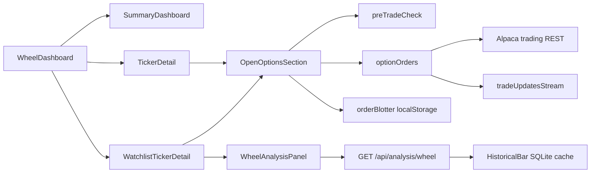

# Trading Desk — Gap Analysis

Maps the institutional requirements in [trading-desk-outline.md](./trading-desk-outline.md) against what this repo ships today. Use this for release planning; use [NEXT_STEPS.md](./NEXT_STEPS.md) for the near-term wheel/analysis backlog.

**Related:** [PRE_LAUNCH.md](./PRE_LAUNCH.md) · [LAUNCH.md](./LAUNCH.md) · [CLAUDE.md](../CLAUDE.md)

---

## 1. Purpose and scope

The outline is an **institutional trading-desk maturity model** (hedge fund, broker-dealer, multi-trader prop shop). This application is a **single-operator wheel strategy desk**: research → strike analysis → Alpaca option execution → position management in one cockpit.

Product trajectory (mission, not a hard schedule):

1. **Today** — Wheel-focused options desk (CSP → stock → CC)
2. **Next** — Broader options strategies on the same OMS/analysis spine
3. **Later** — Other asset classes, still single-operator unless requirements change

Status values in the matrices below:

| Status | Meaning |
|--------|---------|
| **Have** | Shipped and usable for the wheel desk |
| **Partial** | Exists in a limited form; not institutional-grade |
| **Missing** | Not built; relevant to this product’s mission |
| **Out of scope** | Institutional / regulated-entity capability; not a product goal |

---

## 2. Current baseline

| Pillar | Today |
|--------|--------|
| Market data | Alpaca L1 quotes/bars/option snapshots; backend caches historical bars |
| OMS | Sell-to-open + buy-to-close; place/cancel/poll; `client_order_id`; mock path |
| Positions / P&L | Wheel positions + summary metrics (deployed, unrealized, premium, day change) |
| Risk | Client `preTradeCheck` (collateral, coverage, fat-finger); one live order per underlying |
| Blotter | localStorage transitions + pending strip on Summary |
| Compliance / Security | Browser API keys; no MFA/RBAC/server audit |
| Ops | No EOD recon / regulatory reporting |

Key implementation surfaces: `src/api/optionOrders.ts`, `src/api/preTradeCheck.ts`, `src/store/orderBlotter.ts`, `src/hooks/usePendingOptionOrder.ts`, `src/api/tradeUpdatesStream.ts`, `backend/WheelStrategy.Api/`.

---

## 3. Capability matrix

### 3.1 Core business — Order management (outline §1)

| Requirement | Status | Notes |
|-------------|--------|-------|
| Create orders | **Have** | Sell-to-open / buy-to-close via Alpaca `POST /v2/orders` |
| Cancel orders | **Have** | Cancel + wait-for-canceled; UI banner |
| Modify / replace orders | **Missing** | Status types know `pending_replace`; no replace API/UI |
| Market + limit | **Have** | Limit preferred; market allowed with warning |
| Stop / stop-limit | **Missing** | Not offered in ticket |
| Real-time order status | **Partial** | Poll + optional `trade_updates` WS; REST market data (no quote stream) |
| Complete lifecycle history | **Partial** | Append-only blotter in localStorage (`orderBlotter.ts`), capped |
| Partial fills | **Partial** | Status/qty known; no dedicated remaining-qty / fill UX |
| Prevent duplicate orders | **Have** | At most one live option order per underlying |
| Multiple exchanges / venues | **Out of scope** | Single broker (Alpaca) |

### 3.2 Core business — Market data (outline §1 / §4)

| Requirement | Status | Notes |
|-------------|--------|-------|
| Real-time stock quotes (L1) | **Partial** | Latest quotes/snapshots via REST; refresh-driven, not streaming |
| Bid / ask / last / OHLC / volume | **Have** | Stock + option snapshots; 30d bars for charts |
| Historical storage | **Partial** | Analysis backend SQLite `HistoricalBar` cache only |
| Time sync / feed validation | **Missing** | No latency or lost-message monitoring |
| Feed redundancy | **Out of scope** | Single Alpaca feed |
| Level 2 / depth | **Out of scope** | Until desk needs it for equities execution |
| News / calendars / alt data | **Out of scope** | See analysis earnings/divs as a lighter product gap in §3.8 |

### 3.3 Core business — Risk controls (outline §1 / §3)

| Requirement | Status | Notes |
|-------------|--------|-------|
| Pre-trade risk checks | **Partial** | Client-only `preTradeCheck.ts` (collateral, CC coverage, fat-finger, expiry) |
| Position / max-loss limits | **Missing** | No configurable hard/soft limits UI |
| Exposure monitoring | **Missing** | No sector / gross / net exposure views |
| Credit checks | **Partial** | Buying power / cash vs CSP collateral and BTC debit |
| Fat-finger protection | **Have** | Block if limit &gt;35% from mid; warn &gt;15% |
| Trading halt / kill switch | **Missing** | No desk-level cancel-all or disable-new-orders |
| VaR / stress / Monte Carlo | **Out of scope** | Institutional risk engine |

### 3.4 Core business — Compliance & security (outline §1 / §9)

| Requirement | Status | Notes |
|-------------|--------|-------|
| Audit trail | **Partial** | Local blotter transitions; not durable or exportable as compliance evidence |
| Trade surveillance / market abuse | **Out of scope** | Regulated-entity function |
| Record retention / regulatory reporting | **Out of scope** | Broker (Alpaca) retains official records |
| User activity logging | **Missing** | Relevant if multi-user later; single-operator today |
| Best execution tracking | **Out of scope** | Single venue |
| MFA / RBAC | **Out of scope** | No app accounts; broker auth is API keys |
| Encryption in transit | **Partial** | HTTPS/WSS to Alpaca and analysis API |
| Secrets / keys at rest | **Partial** | Keys in browser env (`.env`); not a vaulted server OMS |
| DR / BCP | **Out of scope** | Personal/paper desk; no multi-region HA |

### 3.5 Core business — Position management (outline §1 / §2)

| Requirement | Status | Notes |
|-------------|--------|-------|
| Real-time positions | **Partial** | Alpaca positions → wheel phases; ~5 min refresh |
| Unrealized P&L | **Have** | Per position + Summary rollup |
| Realized P&L | **Missing** | Premium collected is tracked; full realized/assignment P&L not |
| Cost basis | **Have** | From broker positions |
| Portfolio valuation / aggregation | **Partial** | Summary metrics; not a full book |
| Corporate actions | **Missing** | Relies on broker; no desk handling |
| Reconciliation | **Missing** | No EOD position/trade recon workflow |

### 3.6 Trading functionality (outline §2)

| Requirement | Status | Notes |
|-------------|--------|-------|
| Single order entry | **Have** | `OrderTicket` + Friday ladder |
| Quick cancel | **Have** | Working-order banner |
| Quick modify | **Missing** | — |
| Basket orders | **Missing** | Product-relevant for multi-symbol rolls later |
| DMA / routing / SOR | **Out of scope** | Broker routes |
| Advanced algos (TWAP/VWAP/iceberg/OCO/brackets) | **Out of scope** | Except simple OCO/brackets if wheel rolls need them later → then **Missing** |
| Multi-asset (futures/FX/FI) | **Out of scope** | Options (+ equities via assignment) first |
| Execution analytics (TCA, slippage) | **Missing** | Useful once fill history is durable |

### 3.7 Trader workstation (outline §6)

| Requirement | Status | Notes |
|-------------|--------|-------|
| Watchlists | **Have** | `WatchlistPanel` + localStorage store |
| Positions display | **Have** | Summary + ticker tabs |
| Orders / blotter | **Partial** | Pending strip on Summary; no dedicated blotter page |
| P&L dashboard | **Partial** | Unrealized + premium + day change; no daily realized |
| Market overview | **Missing** | No breadth / sector board |
| Sub-second updates / HA | **Partial** | Order WS helps; quotes are poll-based |
| Multi-monitor / hotkeys / DnD | **Missing** | Nice-to-have workstation polish |
| AI / voice | **Out of scope** | Outline “Can” |

### 3.8 Analytics (outline §7) + wheel-specific analysis

Institutional “strategy performance / attribution” maps partly to the analysis API and NEXT_STEPS backlog.

| Requirement | Status | Notes |
|-------------|--------|-------|
| Daily P&L / trade history reports | **Missing** | No export or daily report surface |
| Position / risk reports | **Partial** | On-screen only |
| Wheel strike suggestions | **Have** | `GET /api/analysis/wheel` + `WheelAnalysisPanel` |
| Friday chain snap + live bid/ask | **Have** | `fetchFridayOptions.ts` |
| IV vs realized vol | **Missing** | See NEXT_STEPS |
| Option delta from chain | **Missing** | Model probs used today; NEXT_STEPS |
| Backtest suggestions | **Missing** | NEXT_STEPS |
| Earnings / dividend awareness | **Missing** | NEXT_STEPS |
| Multi-symbol yield ranking | **Missing** | NEXT_STEPS |
| Quant / ML / factor platforms | **Out of scope** | Outline Level 3 |

### 3.9 Technology & operations (outline §5 / §8)

| Requirement | Status | Notes |
|-------------|--------|-------|
| Logging / health | **Partial** | Analysis `GET /health`; no desk ops metrics |
| Real-time messaging | **Partial** | Order `trade_updates` only |
| Durable data storage | **Partial** | Bars in SQLite; blotter in browser |
| EF migrations (vs EnsureCreated) | **Missing** | Backend hardening — NEXT_STEPS |
| Background bar refresh | **Missing** | NEXT_STEPS |
| CI/CD / cloud / IaC | **Partial** | Local Vite + `dotnet run`; no production deploy story |
| EOD recon / settlement / regulatory reports | **Out of scope** | Broker ops |
| Multi-region / K8s / event sourcing | **Out of scope** | Outline Level 3 |

### 3.10 Maturity model (outline §10)

| Level | Outline pillars | Desk today |
|-------|-----------------|------------|
| **1 — Must have** | Market data, OMS, execution, positions, P&L, risk, compliance logging, security, recon | **Partial Level 1**: solid L1 data + wheel OMS + light P&L/risk; weak on durable compliance logging, app security, recon |
| **2 — Should have** | SOR, advanced orders, L2, analytics, auto reporting, stress, surveillance | Mostly **out of scope**; product-relevant slices = advanced option orders, analytics depth, reporting |
| **3 — Best-in-class** | Algos, ML, real-time risk engines, alt data, quant platform | **Out of scope** |

---

## 4. Future release themes

Prioritized themes that close **product-relevant** gaps. Near-term analysis UI items stay in [NEXT_STEPS.md](./NEXT_STEPS.md); this list is the longer arc against the outline.

### Theme 1 — OMS completeness

- Order replace/modify against Alpaca
- Clearer partial-fill UX (filled vs remaining, cancel remainder)
- Dedicated blotter page (working + recent history) beyond the Summary strip
- Optional: simple bracket/OCO when rolling wheel legs

### Theme 2 — Risk & safety

- Configurable position / notional / daily-loss soft limits (warn) and hard limits (block)
- Desk kill switch: cancel open option orders + block new submits
- When API keys move off the browser (server OMS), re-home critical pre-trade checks server-side

### Theme 3 — P&L & reporting

- Realized premium and assignment P&L by underlying and by day
- Trade history export (CSV) from blotter + broker fills
- Strategy attribution for the wheel cycle (CSP premium → stock P&L → CC premium)

### Theme 4 — Analysis depth

Tracked in NEXT_STEPS: distribution viz, prefs persistence, IV vs RV, chain delta, backtest, earnings/dividends, watchlist-wide yield rank. Keep analysis contract single-sourced from the .NET DTOs.

### Theme 5 — Ops durability

- EF Core migrations for `HistoricalBar` (retire `EnsureCreated` before schema changes)
- Background bar warm/refresh for watchlisted symbols
- Durable blotter/audit if the desk is used across devices or browsers
- StatMath unit tests; Alpaca retry/backoff

### Theme 6 — Desk expansion

- Other option strategies on the same ticket/blotter/risk spine
- Equity order entry only when needed for assignment management
- Multi-asset (futures/FX/FI) only after options desk coverage is solid

---

## 5. Explicit non-goals

Do not schedule these as “gaps to close” unless the product becomes a multi-user or regulated firm platform:

- Multi-venue smart order routing, dark pools, TWAP/VWAP/iceberg algos
- FINRA/SEC regulatory reporting or trade surveillance as a regulated entity
- MFA, RBAC, multi-trader firm controls, firm-wide kill switch
- Level 2 order book, alternative data, institutional VaR / Monte Carlo
- Multi-region active-active / Kubernetes / event-sourced OMS
- Replacing the broker’s official books and records

Alpaca (or a future broker) remains the system of record for fills, positions, and regulatory retention.

---

## 6. How to use this doc

| Question | Where to look |
|----------|----------------|
| What does an institutional desk require? | [trading-desk-outline.md](./trading-desk-outline.md) |
| What should we build next for the wheel desk? | [NEXT_STEPS.md](./NEXT_STEPS.md) |
| What’s missing vs the outline, and what’s intentionally skipped? | This file |
| How is the app structured today? | [CLAUDE.md](../CLAUDE.md) |
